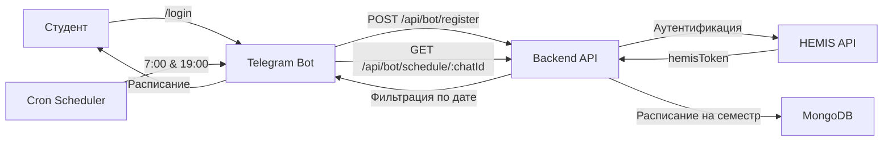

# 📚 HEMIS-Notify

<div align="center">


**Автоматическая система уведомлений о расписании через Telegram**

[](https://nodejs.org/)
[](https://expressjs.com/)
[](https://www.mongodb.com/)
[](https://telegram.org/)

[Возможности](#-возможности) • [Установка](#-установка) • [Использование](#-использование) • [Архитектура](#-архитектура) • [API](#-api-endpoints)

</div>

---

## 📖 О проекте

**HEMIS-Notify** — это интеллектуальная система, которая интегрируется с информационной системой университета (HEMIS) и автоматически отправляет студентам их точное ежедневное расписание через Telegram-бот.

### 🎯 Ключевые преимущества

- ⏰ **Автоматические уведомления** — расписание приходит в 7:00 (на сегодня) и в 19:00 (на завтра)
- 🎓 **Точность 100%** — фильтрация по календарной дате (`lesson_date`)
- 🔄 **Автоматическая ре-аутентификация** — система сама обновляет токены при необходимости
- 🛡️ **Безопасность** — шифрование паролей, защищенные API endpoints
- 🌐 **Универсальность** — работает для всех студенческих групп

---

## ✨ Возможности

- 📅 **Получение расписания** на весь семестр из HEMIS
- 🤖 **Telegram-бот** с интуитивным интерфейсом
- 🔐 **Привязка аккаунта HEMIS** к Telegram
- 📬 **Автоматическая рассылка** расписания
- 🔄 **Перепривязка аккаунта** без потери данных
- 📊 **Умная фильтрация** занятий по датам
- ⚡ **REST API** для интеграции с другими сервисами

---

## 🛠 Технологический стек

### Backend
- **Node.js** + **Express.js** — серверная часть
- **MongoDB** + **Mongoose** — база данных
- **Crypto** — шифрование данных

### Telegram Bot
- **node-telegram-bot-api** — взаимодействие с Telegram API
- **node-cron** — планировщик задач
- **axios** — HTTP-запросы к backend

---

## 📦 Установка

### Предварительные требования

- Node.js >= 14.x
- MongoDB >= 4.x
- Telegram Bot Token (получить у [@BotFather](https://t.me/botfather))

### Шаг 1: Клонирование репозитория

```bash
git clone https://github.com/your-username/hemis-notify.git
cd hemis-notify
```

### Шаг 2: Установка зависимостей

```bash
# Установка корневых зависимостей
npm install

# Установка зависимостей Backend
cd Backend
npm install

# Установка зависимостей TelegramBot
cd ../TelegramBot
npm install
```

### Шаг 3: Настройка окружения

#### Backend/.env
```env
PORT=5000
MONGO_URI=mongodb://localhost:27017/hemis-notify
JWT_SECRET=your_jwt_secret_key
HEMIS_API_URL=https://hemis.example.com/api
ENCRYPTION_KEY=your_32_character_encryption_key
BOT_API_SECRET=your_bot_api_secret_key
```

#### TelegramBot/.env
```env
TELEGRAM_BOT_TOKEN=your_telegram_bot_token
BACKEND_API_URL=http://localhost:5000/api
BOT_API_SECRET=your_bot_api_secret_key
```

### Шаг 4: Запуск проекта

```bash
# Запуск Backend (из корневой папки Backend)
cd Backend
npm start

# Запуск Telegram Bot (из корневой папки TelegramBot)
cd TelegramBot
npm start
```

---

## 🚀 Использование

### Команды Telegram-бота

| Команда | Описание |
|---------|----------|
| `/start` | Начать работу с ботом |
| `/login` | Привязать аккаунт HEMIS |
| `/schedule` | Получить расписание на сегодня |
| `/tomorrow` | Получить расписание на завтра |
| `/relink` | Перепривязать аккаунт HEMIS |
| `/help` | Справка по командам |

### Пример использования

1. Запустите бот командой `/start`
2. Привяжите аккаунт HEMIS через `/login`
3. Введите логин и пароль от HEMIS
4. Получайте расписание автоматически каждый день!

---

## 🏗 Архитектура

```
hemis-notify/
├── Backend/                 # API-сервис
│   ├── config/             # Конфигурация БД
│   ├── middleware/         # Middleware для аутентификации
│   ├── models/             # Mongoose схемы
│   │   ├── User.js        # Модель пользователя
│   │   ├── Schedule.js    # Модель расписания
│   │   ├── Subject.js     # Модель предметов
│   │   └── Grade.js       # Модель оценок
│   ├── routes/            # API маршруты
│   │   ├── bot.js        # Endpoints для бота
│   │   ├── schedule.js   # Логика расписания
│   │   ├── users.js      # Управление пользователями
│   │   ├── subjects.js   # Управление предметами
│   │   └── materials.js  # Учебные материалы
│   ├── utils/            # Утилиты
│   │   └── crypto.js    # Шифрование
│   └── server.js        # Точка входа
│
└── TelegramBot/          # Telegram Bot
    └── bot.js           # Логика бота и планировщик
```

### Схема работы



---

## 📡 API Endpoints

### Bot Endpoints (Защищены секретным ключом)

#### POST `/api/bot/register`
Регистрация/привязка аккаунта HEMIS

**Body:**
```json
{
  "chatId": "123456789",
  "hemisLogin": "student_login",
  "hemisPassword": "student_password"
}
```

#### GET `/api/bot/schedule/:chatId`
Получение расписания пользователя

**Response:**
```json
{
  "schedule": [
    {
      "lesson_date": "2024-11-04",
      "start_time": "08:30",
      "end_time": "10:00",
      "subject": "Математика",
      "room": "201",
      "building": "Главный корпус"
    }
  ]
}
```

#### GET `/api/bot/subscribers`
Получение списка всех подписчиков

---

## 🔐 Безопасность

- 🔒 Пароли HEMIS шифруются перед сохранением в БД
- 🛡️ API endpoints бота защищены секретным ключом
- 🔑 JWT токены для аутентификации
- ✅ Валидация всех входящих данных

---

## 🤝 Вклад в проект

Мы приветствуем ваш вклад в развитие проекта!

1. Fork репозитория
2. Создайте ветку для новой функции (`git checkout -b feature/AmazingFeature`)
3. Commit изменения (`git commit -m 'Add some AmazingFeature'`)
4. Push в ветку (`git push origin feature/AmazingFeature`)
5. Откройте Pull Request

---

## 📝 Лицензия

Этот проект распространяется под лицензией MIT. Подробности в файле [LICENSE](LICENSE).

---

## 👨‍💻 Автор

**Ваше имя**

- GitHub: [@your-username](https://github.com/your-username)
- Telegram: [@your-telegram]

---

## 📞 Поддержка

Если у вас возникли вопросы или проблемы:

- 🐛 [Создайте Issue](https://github.com/your-username/hemis-notify/issues)
- 💬 Напишите в Telegram: [@your-telegram]
- 📧 Email: your.email@example.com

---

<div align="center">

**Сделано с ❤️ для студентов**

⭐ Поставьте звезду, если проект вам полезен!

</div>
